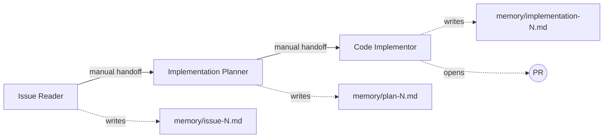
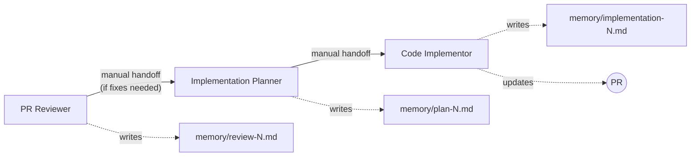

# MonthlyBudget

A personal/household monthly budget management application built as a **modular monolith** with hexagonal architecture.

## Tech Stack

| Layer | Technology |
|---|---|
| Backend | C# / ASP.NET Core, MediatR, FluentValidation, EF Core, PostgreSQL |
| Auth | JWT (`System.IdentityModel.Tokens.Jwt`), BCrypt (`BCrypt.Net-Next`) |
| Frontend | SvelteKit, TypeScript, Chart.js *(not yet implemented)* |
| Tests | xUnit (unit), Testcontainers (integration) |

## Project Structure

```
src/
├── Modules/
│   ├── MonthlyBudget.BudgetManagement/   # Core: budgets, income, expenses, rollover
│   ├── MonthlyBudget.ForecastEngine/     # Core: simulation, snapshots, re-forecast, drift
│   └── MonthlyBudget.IdentityHousehold/  # Supporting: users, JWT auth, household
├── MonthlyBudget.Api/                    # API host (Program.cs, controllers)
├── MonthlyBudget.Infrastructure/         # Cross-cutting: EF Core, repositories, ACL, middleware
└── MonthlyBudget.SharedKernel/           # Shared types: HouseholdId, UserId, IDomainEvent
tests/
├── MonthlyBudget.BudgetManagement.Tests/
├── MonthlyBudget.ForecastEngine.Tests/
├── MonthlyBudget.IdentityHousehold.Tests/
└── MonthlyBudget.Integration.Tests/
```

Each bounded context follows a three-layer hexagonal structure: `Domain/` → `Application/` → `Infrastructure/`.

## Getting Started

```powershell
# Start PostgreSQL
docker compose up -d postgres

# Build
dotnet build

# Run tests
dotnet test

# Run the API
dotnet run --project src/MonthlyBudget.Api
```

## Documentation

- [Architecture Spec](docs/MonthlyBudget_Architecture.md) — Full architectural specification
- [Codebase Guide](AGENTS.md) — Architecture overview, conventions, invariants
- [Completion Status](docs/BE_Completion_Handoff.md) — Backend completion handoff

---

## Agent Workflows

This project uses a **multi-agent pipeline** with manual handoffs to implement features and review PRs. All agents are defined as `.agent.md` files under `.github/agents/` and share three global rules:

### Global Rules

1. **No Suppositions** — Agents never assume or guess. If anything is ambiguous, they halt and ask the user.
2. **Memory-Driven Handoffs** — Agents pass context by writing structured files to `.github/agents/memory/`, never via prompt-only. Naming convention: `<type>-<issue-number>.md`.
3. **Git Discipline** — Never push during implementation (only when opening a PR). Never commit code that doesn't build or has failing tests. Never merge PRs.

### Workflow 1 — Feature Implementation

Used when implementing a new feature or task from a GitHub issue.



| Step | Agent | Invokable | What It Does |
|---|---|---|---|
| 1 | **Issue Reader** | Yes (entry point) | Fetches the GitHub issue, parent epic, sub-issues, and architecture context. Writes `memory/issue-<N>.md`. |
| 2 | **Implementation Planner** | No (handoff only) | Reads the issue memory, analyzes the codebase, and produces a precise file-level plan with exact paths, method signatures, and changes per file. Writes `memory/plan-<N>.md`. |
| 3 | **Code Implementor** | No (handoff only) | Reads the plan, creates a feature branch, implements code + tests per feature, commits incrementally, validates the API (if endpoints touched), pushes, and opens a PR. Writes `memory/implementation-<N>.md`. |

**Handoff chain:** Each step finishes by offering a manual handoff button to the next agent. The user triggers each transition.

### Workflow 2 — PR Review & Fix

Used when reviewing an existing PR and fixing any issues found.



| Step | Agent | Invokable | What It Does |
|---|---|---|---|
| 1 | **PR Reviewer** | Yes (entry point) | Reviews the PR diff against architecture spec, domain invariants, coding conventions, acceptance criteria, and — if endpoints are touched — **spins up the API and exercises every affected endpoint at runtime**. Writes `memory/review-<N>.md` with verdict (APPROVED / CHANGES REQUESTED / BLOCKED). |
| 2 | **Implementation Planner** | No (handoff only) | *(Only if verdict is ⚠️ or ❌)* Reads the review memory, plans the fixes. Writes `memory/plan-<N>.md`. |
| 3 | **Code Implementor** | No (handoff only) | Executes the fix plan on the existing branch, commits, re-validates, and updates the PR. |

**PR Reviewer** performs both **static review** (code inspection against contracts) and **runtime API validation** (starting the API and calling endpoints). If any endpoint fails at runtime, it's classified as a CRITICAL finding.

### Agents Summary

| Agent | File | User-Invokable | Hands Off To |
|---|---|---|---|
| Issue Reader | `.github/agents/issue-reader.agent.md` | Yes | Implementation Planner |
| Implementation Planner | `.github/agents/implementation-planner.agent.md` | No | Code Implementor |
| Code Implementor | `.github/agents/code-implementor.agent.md` | No | *(terminal — opens PR)* |
| PR Reviewer | `.github/agents/pr-reviewer.agent.md` | Yes | Implementation Planner (if fixes needed) |

### Skills

Agents reference reusable skill files for specific workflows:

| Skill | File | Purpose |
|---|---|---|
| dotnet-tdd | `.github/skills/dotnet-tdd/SKILL.md` | Build, test, and EF Core migration commands |
| api-exercise | `.github/skills/api-exercise/SKILL.md` | API startup, JWT auth setup, and endpoint validation scripts |
| hexagonal-validation | `.github/skills/hexagonal-validation/SKILL.md` | Architecture purity checks (domain isolation, cross-context boundaries) |

### Memory Files

All inter-agent communication goes through structured markdown files in `.github/agents/memory/`:

| File Pattern | Written By | Read By |
|---|---|---|
| `issue-<N>.md` | Issue Reader | Implementation Planner |
| `plan-<N>.md` | Implementation Planner | Code Implementor |
| `implementation-<N>.md` | Code Implementor | *(reference)* |
| `review-<N>.md` | PR Reviewer | Implementation Planner |
