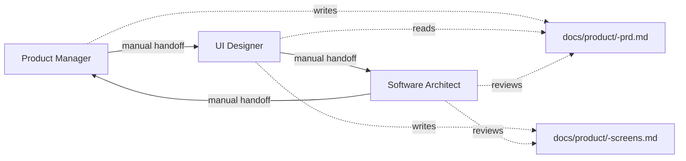
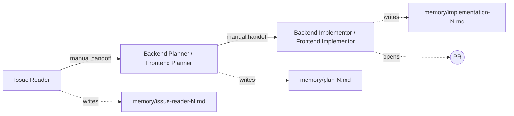
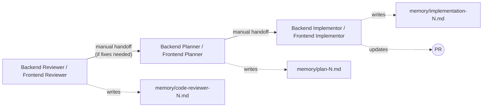

# MonthlyBudget

A personal/household monthly budget management application built as a **modular monolith** with hexagonal architecture.

## Tech Stack

| Layer | Technology |
|---|---|
| Backend | C# / ASP.NET Core, MediatR, FluentValidation, EF Core, PostgreSQL |
| Auth | JWT (`System.IdentityModel.Tokens.Jwt`), BCrypt (`BCrypt.Net-Next`) |
| Frontend | SvelteKit, TypeScript, Chart.js *(not yet implemented)* |
| Tests | xUnit (unit), Testcontainers (integration) |

## Project Structure

```
src/
├── Modules/
│   ├── MonthlyBudget.BudgetManagement/   # Core: budgets, income, expenses, rollover
│   ├── MonthlyBudget.ForecastEngine/     # Core: simulation, snapshots, re-forecast, drift
│   └── MonthlyBudget.IdentityHousehold/  # Supporting: users, JWT auth, household
├── MonthlyBudget.Api/                    # API host (Program.cs, controllers)
├── MonthlyBudget.Infrastructure/         # Cross-cutting: EF Core, repositories, ACL, middleware
└── MonthlyBudget.SharedKernel/           # Shared types: HouseholdId, UserId, IDomainEvent
tests/
├── MonthlyBudget.BudgetManagement.Tests/
├── MonthlyBudget.ForecastEngine.Tests/
├── MonthlyBudget.IdentityHousehold.Tests/
└── MonthlyBudget.Integration.Tests/
```

Each bounded context follows a three-layer hexagonal structure: `Domain/` → `Application/` → `Infrastructure/`.

## Getting Started

```powershell
# Start PostgreSQL
docker compose up -d postgres

# Build
dotnet build

# Run tests
dotnet test

# Run the API
dotnet run --project src/MonthlyBudget.Api
```

## Documentation

- [Architecture Spec](docs/MonthlyBudget_Architecture.md) — Full architectural specification
- [Codebase Guide](AGENTS.md) — Architecture overview, conventions, invariants
- [Completion Status](docs/BE_Completion_Handoff.md) — Backend completion handoff

---

## Agent Workflows

This project uses **custom agents** defined as `.agent.md` files under `.github/agents/`. The workflow now has two complementary tracks:

- **Product discovery & UI alignment** — Product Manager → UI Designer → Software Architect → Product Manager
- **Implementation & review** — Issue Reader → Backend/Frontend Planner → Backend/Frontend Implementor → Backend/Frontend Reviewer

Agents share three global rules:

### Global Rules

1. **No Suppositions** — Agents never assume or guess. If anything is ambiguous, they halt and ask the user.
2. **Artifact-Driven Handoffs** — Agents never rely on prompt-only context passing. Implementation/review agents write structured files to `.github/agents/memory/`. Product/design agents write durable artifacts to `docs/product/` and use those files as the source of truth.
3. **Git Discipline** — Never push during implementation (only when opening a PR). Never commit code that doesn't build or has failing tests. Never merge PRs.

### Workflow 0 — Product Discovery & UI Alignment

Used when defining the product requirements, aligning on UX, and validating feasibility before implementation planning starts.



| Step | Agent | Invokable | What It Does |
|---|---|---|---|
| 1 | **Product Manager** | Yes | Discovers business goals using JTBD + Lean Startup, synthesizes MVP scope, and writes `docs/product/<feature>-prd.md`. |
| 2 | **UI Designer** | Yes | Reads the PRD, uses Google Stitch MCP to generate full UI screens, and writes `docs/product/<feature>-screens.md`. |
| 3 | **Software Architect** | Yes | Reviews the PRD and generated screens for architecture feasibility, API/data-model alignment, and bounded-context fit, then hands back to Product Manager for iteration. |

**Handoff chain:** `Product Manager → UI Designer → Software Architect → Product Manager`

**Source of truth:** `docs/product/*.md` artifacts, not chat-only context.

### Workflow 1 — Feature Implementation

Used when implementing a new feature or task from a GitHub issue.



| Step | Agent | Invokable | What It Does |
|---|---|---|---|
| 1 | **Issue Reader** | Yes (entry point) | Fetches the GitHub issue, parent epic, sub-issues, and architecture context. Writes `.github/agents/memory/issue-reader-<N>.md`. |
| 2 | **Backend Planner** / **Frontend Planner** | Yes | Reads the issue memory, analyzes the relevant codebase, and produces a precise file-level plan. Writes `.github/agents/memory/plan-<N>.md`. |
| 3 | **Backend Implementor** / **Frontend Implementor** | Yes | Reads the plan, creates or checks out the feature branch, implements code + tests, validates affected flows, pushes, and opens or updates a PR. Writes `.github/agents/memory/implementation-<N>.md`. |

**Handoff chain:** Each step finishes by offering a manual handoff button to the next agent. The user triggers each transition.

### Workflow 2 — PR Review & Fix

Used when reviewing an existing PR and fixing any issues found.



| Step | Agent | Invokable | What It Does |
|---|---|---|---|
| 1 | **Backend Reviewer** / **Frontend Reviewer** | Yes (entry point) | Reviews the PR using the additive review model, validates contracts and architecture rules, and writes `.github/agents/memory/code-reviewer-<N>.md`. |
| 2 | **Backend Planner** / **Frontend Planner** | Yes | *(Only if fixes are needed)* Reads OPEN review points, plans the fixes, and updates `.github/agents/memory/plan-<N>.md`. |
| 3 | **Backend Implementor** / **Frontend Implementor** | Yes | Executes the fix plan on the existing branch, commits, re-validates, replies in review threads, and updates the PR. |

**Reviewers** use the additive review model: first round is a full review, later rounds only inspect changed files unless the PR becomes stale.

### Agents Summary

| Agent | File | User-Invokable | Hands Off To |
|---|---|---|---|
| Product Manager | `.github/agents/product-manager.agent.md` | Yes | UI Designer, Software Architect |
| UI Designer | `.github/agents/ui-designer.agent.md` | Yes | Software Architect, Product Manager |
| Software Architect | `.github/agents/software-architect.agent.md` | Yes | Product Manager, UI Designer |
| Issue Reader | `.github/agents/issue-reader.agent.md` | Yes | Backend Planner, Frontend Planner |
| Backend Planner | `.github/agents/backend-planner.agent.md` | Yes | Backend Implementor |
| Backend Implementor | `.github/agents/backend-implementor.agent.md` | Yes | *(terminal — opens or updates PR)* |
| Backend Reviewer | `.github/agents/backend-reviewer.agent.md` | Yes | Backend Planner (if fixes needed) |
| Frontend Planner | `.github/agents/frontend-planner.agent.md` | Yes | Frontend Implementor |
| Frontend Implementor | `.github/agents/frontend-implementor.agent.md` | Yes | *(terminal — opens or updates PR)* |
| Frontend Reviewer | `.github/agents/frontend-reviewer.agent.md` | Yes | Frontend Planner (if fixes needed) |

### Skills

Agents reference reusable skill files for specific workflows:

| Skill | File | Purpose |
|---|---|---|
| dotnet-tdd | `.github/skills/dotnet-tdd/SKILL.md` | Build, test, and EF Core migration commands |
| api-exercise | `.github/skills/api-exercise/SKILL.md` | API startup, JWT auth setup, and endpoint validation scripts |
| hexagonal-validation | `.github/skills/hexagonal-validation/SKILL.md` | Architecture purity checks (domain isolation, cross-context boundaries) |

### Memory Files

All inter-agent communication goes through structured markdown files in `.github/agents/memory/`:

| File Pattern | Written By | Read By |
|---|---|---|
| `issue-reader-<N>.md` | Issue Reader | Backend Planner / Frontend Planner |
| `plan-<N>.md` | Backend Planner / Frontend Planner | Backend Implementor / Frontend Implementor |
| `implementation-<N>.md` | Backend Implementor / Frontend Implementor | *(reference)* |
| `code-reviewer-<N>.md` | Backend Reviewer / Frontend Reviewer | Backend Planner / Frontend Planner |

Product and design artifacts live in `docs/product/`:

| File Pattern | Written By | Read By |
|---|---|---|
| `<feature>-prd.md` | Product Manager | UI Designer, Software Architect, planners |
| `<feature>-screens.md` | UI Designer | Product Manager, Software Architect, frontend agents |
