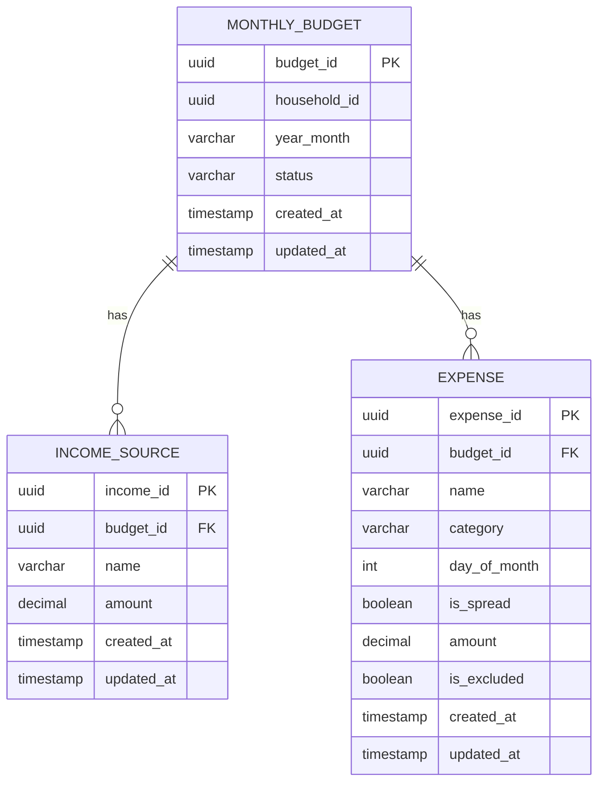
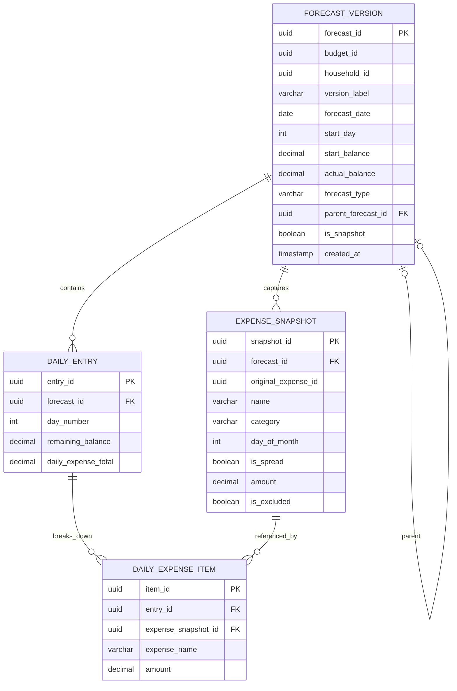
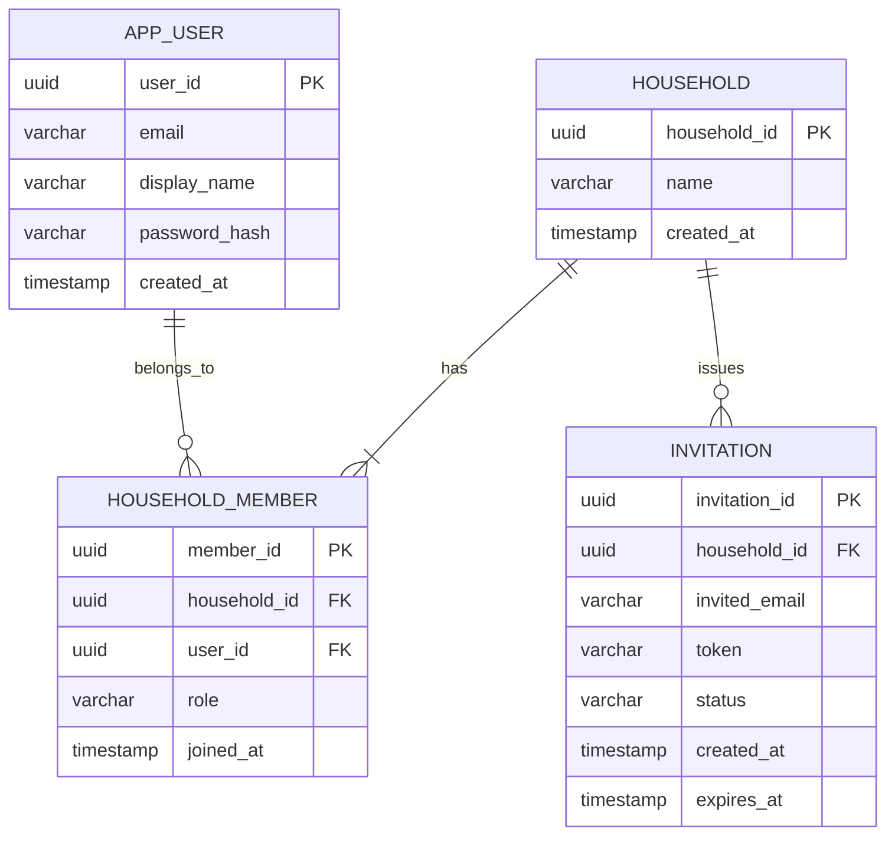
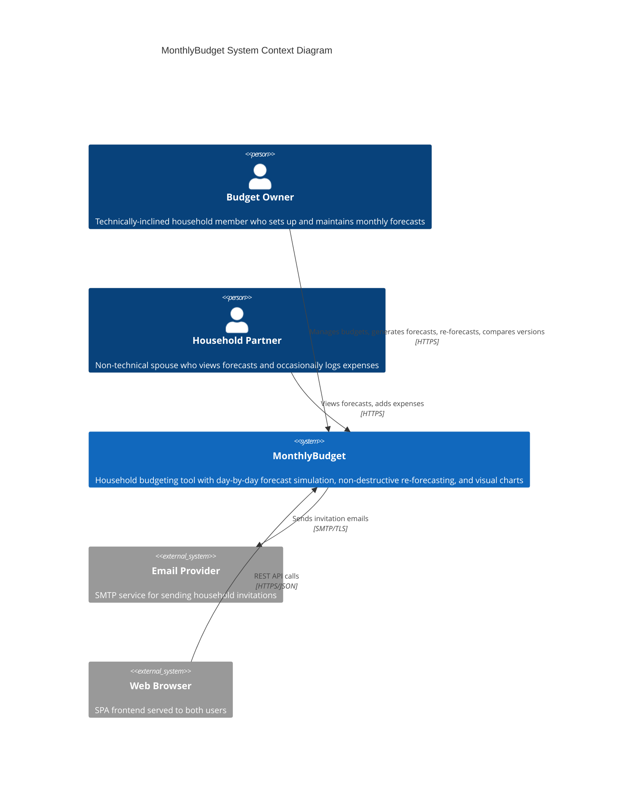
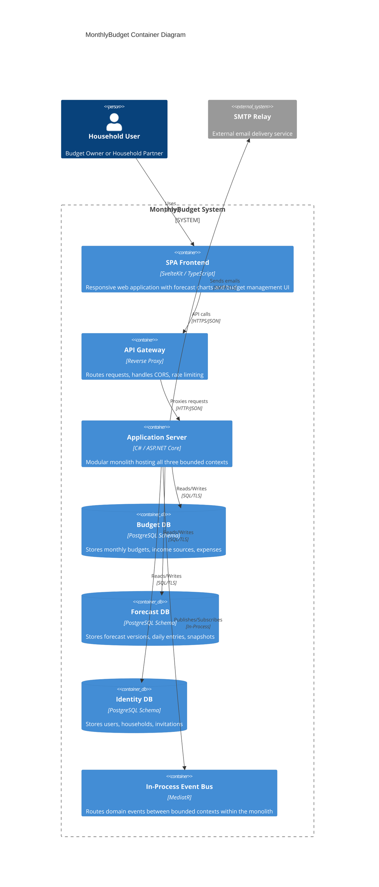
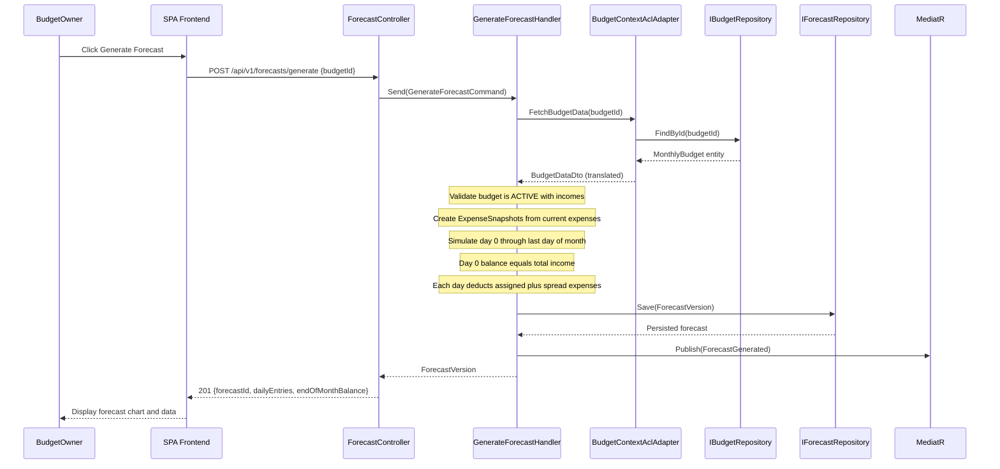
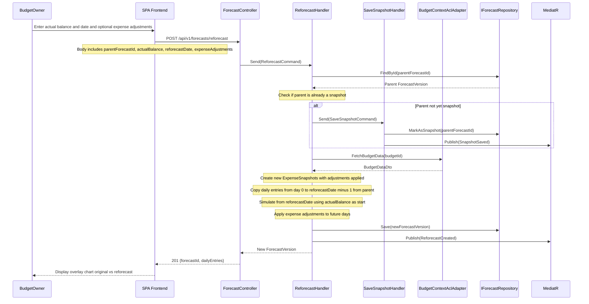
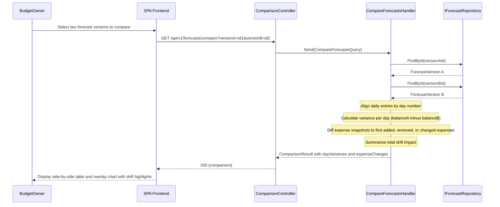
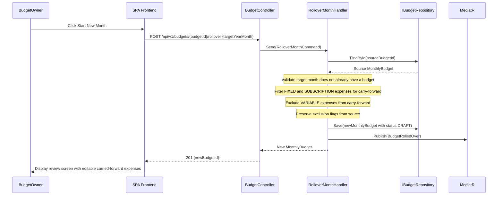

# MonthlyBudget — System Architecture Consensus Model

**Architect:** Principal Enterprise Architect Agent
**Date:** 2026-03-01
**Source PRD Version:** MonthlyBudget PRD v1.0
**Architecture Style:** Modular Monolith with Bounded Context Isolation
**Status:** APPROVED — Ready for Downstream Consumption

---

## Table of Contents

1. [Phase 1: Strategic Domain Modeling (DDD)](#phase-1-strategic-domain-modeling-ddd)
2. [Phase 2: Hexagonal Architecture Mapping](#phase-2-hexagonal-architecture-mapping)
3. [Phase 3: Persistence and Event-Driven Schemas](#phase-3-persistence-and-event-driven-schemas)
4. [Phase 4: Visual Documentation and Decision Tracking](#phase-4-visual-documentation-and-decision-tracking)

---

## Phase 1: Strategic Domain Modeling (DDD)

### 1.1 Bounded Context Map

Three bounded contexts are identified from the PRD. Each owns its persistence layer exclusively.

| Bounded Context | Classification | Responsibility | Upstream / Downstream |
| :--- | :--- | :--- | :--- |
| **Budget Management** | Core Domain | Owns the definition of monthly budgets: income sources, expenses (fixed, subscription, variable, spread), expense categorization, temporary exclusion, month-to-month rollover. | Upstream to Forecast Engine (publishes budget state) |
| **Forecast Engine** | Core Domain | Owns forecast simulation, snapshot versioning, non-destructive re-forecasting, drift analysis, and forecast comparison. | Downstream of Budget Management (consumes budget data via ACL) |
| **Identity and Household** | Supporting Domain | Owns user accounts, authentication, household creation, member invitations, and authorization scope (household-level tenancy). | Shared Kernel: `householdId` is the universal tenant identifier consumed by both core contexts |

### 1.2 Context Relationships

| Relationship | Pattern | Description |
| :--- | :--- | :--- |
| Budget Management → Forecast Engine | Anti-Corruption Layer (ACL) | Forecast Engine translates Budget Management data into its own `ExpenseSnapshot` value objects. No shared domain models. Domain events (`BudgetActivated`, `ExpenseUpdated`) are published by Budget Management and consumed by Forecast Engine via an in-process event bus. |
| Identity and Household ↔ Budget Management | Shared Kernel | `householdId` (UUID) is the shared identity concept. Budget Management references it as a tenant boundary. No direct domain model sharing beyond this identifier. |
| Identity and Household ↔ Forecast Engine | Shared Kernel | Same `householdId` shared kernel. Forecast Engine uses it for tenant-scoped queries. |

### 1.3 Aggregate Root Definitions

#### Aggregate Root: MonthlyBudget

| Attribute | Detail |
| :--- | :--- |
| **Name** | `MonthlyBudget` |
| **Context** | Budget Management |

**State Properties:**

| Property | Type | Constraints |
| :--- | :--- | :--- |
| `budgetId` | `UUID` | PK, immutable |
| `householdId` | `UUID` | FK to Household, immutable after creation |
| `yearMonth` | `YearMonth` | Format YYYY-MM, immutable after creation |
| `status` | `Enum(DRAFT, ACTIVE, CLOSED)` | State machine: DRAFT → ACTIVE → CLOSED |
| `incomeSources` | `List<IncomeSource>` | At least 1 required before activation |
| `expenses` | `List<Expense>` | 0 or more |
| `createdAt` | `DateTime` | Immutable |
| `updatedAt` | `DateTime` | Auto-updated on mutation |

**Value Object — IncomeSource:**

| Property | Type | Constraints |
| :--- | :--- | :--- |
| `incomeId` | `UUID` | PK |
| `name` | `String(1..100)` | Non-empty, trimmed |
| `amount` | `Decimal(12,2)` | Must be > 0, EUR |

**Value Object — Expense:**

| Property | Type | Constraints |
| :--- | :--- | :--- |
| `expenseId` | `UUID` | PK |
| `name` | `String(1..100)` | Non-empty, trimmed |
| `category` | `Enum(FIXED, SUBSCRIPTION, VARIABLE)` | Required |
| `dayOfMonth` | `Int(1..31) \| null` | Required if `isSpread = false`; must be null if `isSpread = true` |
| `isSpread` | `Boolean` | If true, expense is distributed evenly across all days |
| `amount` | `Decimal(12,2)` | Must be > 0, EUR |
| `isExcluded` | `Boolean` | If true, excluded from current month simulation |

**Enforced Invariants:**

| # | Invariant | Enforcement |
| :--- | :--- | :--- |
| INV-B1 | At least one income source must exist before budget activation | `activate()` throws `InsufficientIncomeError` if `incomeSources` is empty |
| INV-B2 | Expense day must be valid for the budget month | `addExpense()` validates `dayOfMonth <= lastDayOfMonth(yearMonth)` |
| INV-B3 | Spread expenses must not have a specific day | `addExpense()` rejects if `isSpread = true AND dayOfMonth != null` |
| INV-B4 | Specific-day expenses must have a day assigned | `addExpense()` rejects if `isSpread = false AND dayOfMonth == null` |
| INV-B5 | Amount must be strictly positive | `addExpense()` and `addIncome()` reject if `amount <= 0` |
| INV-B6 | Budget status transitions are unidirectional | State machine: DRAFT → ACTIVE → CLOSED. No reverse transitions. |
| INV-B7 | Only one budget per household per month | Repository enforces unique constraint on `(householdId, yearMonth)` |
| INV-B8 | Only ACTIVE budgets can be modified | Mutations rejected if `status != ACTIVE` (except initial setup in DRAFT) |

**Corrective Policies:**

| Policy | Trigger | Action |
| :--- | :--- | :--- |
| AutoActivateOnFirstForecast | Forecast Engine requests forecast generation for a DRAFT budget | Transition budget from DRAFT to ACTIVE |
| PreventOrphanedForecasts | Budget transitions to CLOSED | Publish `BudgetClosed` event; Forecast Engine marks all open forecasts as finalized |

**Domain Events:**

| Event | Payload Keys | Published When |
| :--- | :--- | :--- |
| `BudgetCreated` | `budgetId`, `householdId`, `yearMonth` | New budget instantiated |
| `BudgetActivated` | `budgetId`, `householdId`, `yearMonth` | Budget transitions to ACTIVE |
| `IncomeSourceAdded` | `budgetId`, `incomeId`, `name`, `amount` | Income added |
| `IncomeSourceUpdated` | `budgetId`, `incomeId`, `name`, `amount` | Income modified |
| `IncomeSourceRemoved` | `budgetId`, `incomeId` | Income removed |
| `ExpenseAdded` | `budgetId`, `expenseId`, `name`, `category`, `dayOfMonth`, `isSpread`, `amount` | Expense added |
| `ExpenseUpdated` | `budgetId`, `expenseId`, changed fields | Expense modified |
| `ExpenseRemoved` | `budgetId`, `expenseId` | Expense deleted |
| `ExpenseExclusionToggled` | `budgetId`, `expenseId`, `isExcluded` | Exclusion toggled |
| `BudgetRolledOver` | `sourceBudgetId`, `targetBudgetId`, `targetYearMonth` | Month rollover executed |
| `BudgetClosed` | `budgetId`, `householdId`, `yearMonth` | Budget finalized |

---

#### Aggregate Root: ForecastVersion

| Attribute | Detail |
| :--- | :--- |
| **Name** | `ForecastVersion` |
| **Context** | Forecast Engine |

**State Properties:**

| Property | Type | Constraints |
| :--- | :--- | :--- |
| `forecastId` | `UUID` | PK, immutable |
| `budgetId` | `UUID` | References source budget, immutable |
| `householdId` | `UUID` | Tenant scope, immutable |
| `versionLabel` | `String(1..50)` | User-friendly label (e.g., "Original", "Re-forecast Mar 15") |
| `forecastDate` | `LocalDate` | Date this forecast was generated, immutable |
| `startDay` | `Int(0..31)` | Day from which simulation begins (0 = start of month) |
| `startBalance` | `Decimal(12,2)` | EUR, starting balance for the simulation |
| `dailyEntries` | `List<DailyEntry>` | Ordered day 0 through last day of month |
| `expenseSnapshot` | `List<ExpenseSnapshot>` | Frozen copy of expenses at generation time |
| `actualBalance` | `Decimal(12,2) \| null` | User-entered actual bank balance (for re-forecasts) |
| `forecastType` | `Enum(ORIGINAL, REFORECAST)` | Distinguishes baseline from re-forecasts |
| `parentForecastId` | `UUID \| null` | Required for REFORECAST type; references the parent forecast |
| `isSnapshot` | `Boolean` | True if explicitly saved as an immutable snapshot |
| `createdAt` | `DateTime` | Immutable |

**Value Object — DailyEntry:**

| Property | Type | Constraints |
| :--- | :--- | :--- |
| `day` | `Int(0..31)` | Day of month |
| `remainingBalance` | `Decimal(12,2)` | Balance after all expenses for this day |
| `dailyExpenseTotal` | `Decimal(12,2)` | Sum of all expenses on this day |
| `expenseBreakdown` | `List<ExpenseItem>` | Individual expenses contributing to this day |

**Value Object — ExpenseItem:**

| Property | Type | Constraints |
| :--- | :--- | :--- |
| `expenseSnapshotId` | `UUID` | Reference to frozen expense |
| `name` | `String` | Expense name |
| `amount` | `Decimal(12,2)` | Amount deducted on this day |

**Value Object — ExpenseSnapshot:**

| Property | Type | Constraints |
| :--- | :--- | :--- |
| `snapshotId` | `UUID` | PK |
| `originalExpenseId` | `UUID` | Source expense ID from Budget context |
| `name` | `String(1..100)` | Frozen name |
| `category` | `Enum(FIXED, SUBSCRIPTION, VARIABLE)` | Frozen category |
| `dayOfMonth` | `Int(1..31) \| null` | Frozen day |
| `isSpread` | `Boolean` | Frozen spread flag |
| `amount` | `Decimal(12,2)` | Frozen amount |
| `isExcluded` | `Boolean` | Frozen exclusion state |

**Enforced Invariants:**

| # | Invariant | Enforcement |
| :--- | :--- | :--- |
| INV-F1 | Forecast must have daily entries covering startDay through end of month | `generate()` validates completeness |
| INV-F2 | REFORECAST must reference a valid parent forecast | `createReforecast()` rejects if `parentForecastId` is null or invalid |
| INV-F3 | ORIGINAL forecast must have `startDay = 0` | Enforced at creation |
| INV-F4 | Snapshot forecasts are immutable | All mutations rejected if `isSnapshot = true` |
| INV-F5 | Daily entries must be chronologically ordered | `generate()` ensures ordering |
| INV-F6 | Start balance for ORIGINAL equals total income | Validated against budget income sum at generation time |
| INV-F7 | Only one ORIGINAL forecast per budget | Repository enforces unique constraint on `(budgetId, forecastType=ORIGINAL)` — subsequent originals require explicit replacement |

**Corrective Policies:**

| Policy | Trigger | Action |
| :--- | :--- | :--- |
| AutoSnapshotOnReforecast | User initiates re-forecast | If ORIGINAL forecast is not yet a snapshot, automatically save it as snapshot before proceeding |
| PropagateExpenseChanges | `ExpenseUpdated` or `ExpenseAdded` event received from Budget context | Flag affected forecasts as potentially stale (UI indicator); do NOT auto-regenerate |

**Domain Events:**

| Event | Payload Keys | Published When |
| :--- | :--- | :--- |
| `ForecastGenerated` | `forecastId`, `budgetId`, `householdId`, `forecastType`, `forecastDate` | New forecast simulation completed |
| `SnapshotSaved` | `forecastId`, `budgetId`, `snapshotDate` | Forecast explicitly saved as snapshot |
| `ReforecastCreated` | `forecastId`, `parentForecastId`, `budgetId`, `actualBalance`, `startDay` | Re-forecast generated from actual balance |
| `ForecastStaleMarked` | `forecastId`, `reason` | Budget changes invalidate existing forecast |

---

#### Aggregate Root: Household

| Attribute | Detail |
| :--- | :--- |
| **Name** | `Household` |
| **Context** | Identity and Household |

**State Properties:**

| Property | Type | Constraints |
| :--- | :--- | :--- |
| `householdId` | `UUID` | PK, immutable |
| `name` | `String(1..100)` | Household display name |
| `members` | `List<Member>` | 1–2 members (MVP) |
| `createdAt` | `DateTime` | Immutable |

**Value Object — Member:**

| Property | Type | Constraints |
| :--- | :--- | :--- |
| `userId` | `UUID` | FK to User |
| `role` | `Enum(OWNER, PARTNER)` | Exactly one OWNER required |
| `joinedAt` | `DateTime` | Immutable |

**Entity — User (Standalone Entity, same context):**

| Property | Type | Constraints |
| :--- | :--- | :--- |
| `userId` | `UUID` | PK, immutable |
| `email` | `String` | Unique, valid email format |
| `displayName` | `String(1..100)` | Non-empty |
| `passwordHash` | `String` | bcrypt/argon2 hash, never exposed |
| `createdAt` | `DateTime` | Immutable |

**Entity — Invitation (Standalone Entity, same context):**

| Property | Type | Constraints |
| :--- | :--- | :--- |
| `invitationId` | `UUID` | PK, immutable |
| `householdId` | `UUID` | FK to Household |
| `invitedEmail` | `String` | Valid email format |
| `token` | `String` | Unique, cryptographically random |
| `status` | `Enum(PENDING, ACCEPTED, EXPIRED)` | State machine: PENDING → ACCEPTED or EXPIRED |
| `createdAt` | `DateTime` | Immutable |
| `expiresAt` | `DateTime` | TTL-based expiration |

**Enforced Invariants:**

| # | Invariant | Enforcement |
| :--- | :--- | :--- |
| INV-H1 | Maximum 2 members per household | `addMember()` rejects if `members.size >= 2` |
| INV-H2 | Exactly one OWNER per household | `addMember()` rejects role=OWNER if one exists; OWNER removal is forbidden |
| INV-H3 | Email must be globally unique across users | Repository enforces unique constraint on `email` |
| INV-H4 | Only one pending invitation per household | `createInvitation()` rejects if a PENDING invitation exists |
| INV-H5 | Expired invitations cannot be accepted | `acceptInvitation()` checks `expiresAt > now()` |

**Corrective Policies:**

| Policy | Trigger | Action |
| :--- | :--- | :--- |
| ExpireStaleInvitations | Scheduled job (daily) | Transition PENDING invitations past `expiresAt` to EXPIRED |

**Domain Events:**

| Event | Payload Keys | Published When |
| :--- | :--- | :--- |
| `HouseholdCreated` | `householdId`, `ownerId` | Household instantiated |
| `MemberInvited` | `householdId`, `invitationId`, `invitedEmail` | Invitation created |
| `MemberJoined` | `householdId`, `userId`, `role` | Invited user accepted and joined |

---

## Phase 2: Hexagonal Architecture Mapping

### 2.1 Deployment Topology

A **modular monolith** deployed as a single process with strict internal module boundaries. Each bounded context is an isolated class library project with its own domain layer, application layer, and infrastructure adapters. Contexts communicate via an **in-process MediatR event bus** and **explicit interface contracts**.

### 2.2 Budget Management Context — Port/Adapter Map

| Layer | Component | Type | Description |
| :--- | :--- | :--- | :--- |
| **Primary Adapter** | `BudgetController` | ASP.NET Controller | Exposes `/api/v1/budgets/**` endpoints |
| **Primary Adapter** | `IncomeController` | ASP.NET Controller | Exposes `/api/v1/budgets/{id}/incomes/**` endpoints |
| **Primary Adapter** | `ExpenseController` | ASP.NET Controller | Exposes `/api/v1/budgets/{id}/expenses/**` endpoints |
| **Primary Port** | `CreateBudgetHandler` | MediatR Handler | Creates a new MonthlyBudget for a household/month |
| **Primary Port** | `ManageIncomeHandler` | MediatR Handler | Add, update, remove income sources |
| **Primary Port** | `ManageExpenseHandler` | MediatR Handler | Add, update, remove, toggle exclusion for expenses |
| **Primary Port** | `RolloverMonthHandler` | MediatR Handler | Carries forward recurring expenses to a new month |
| **Primary Port** | `GetBudgetQueryHandler` | MediatR Handler | Read-only queries for budget data |
| **Secondary Port** | `IBudgetRepository` | Interface | `Save(budget)`, `FindById(id)`, `FindByHouseholdAndMonth(householdId, yearMonth)` |
| **Secondary Port** | `IBudgetEventPublisher` | Interface | `Publish(domainEvent)` |
| **Secondary Adapter** | `PostgresBudgetRepository` | Infrastructure | PostgreSQL + EF Core implementation of `IBudgetRepository` |
| **Secondary Adapter** | `MediatRBudgetEventPublisher` | Infrastructure | MediatR-based event bus implementation |

### 2.3 Forecast Engine Context — Port/Adapter Map

| Layer | Component | Type | Description |
| :--- | :--- | :--- | :--- |
| **Primary Adapter** | `ForecastController` | ASP.NET Controller | Exposes `/api/v1/forecasts/**` endpoints |
| **Primary Adapter** | `ComparisonController` | ASP.NET Controller | Exposes `/api/v1/forecasts/compare/**` endpoints |
| **Primary Adapter** | `BudgetEventHandler` | MediatR Notification Handler | Consumes domain events from Budget Management context |
| **Primary Port** | `GenerateForecastHandler` | MediatR Handler | Runs day-by-day simulation from budget data |
| **Primary Port** | `SaveSnapshotHandler` | MediatR Handler | Saves current forecast as immutable snapshot |
| **Primary Port** | `ReforecastHandler` | MediatR Handler | Creates new forecast from actual balance mid-month |
| **Primary Port** | `CompareForecastsHandler` | MediatR Handler | Compares two forecast versions with drift analysis |
| **Primary Port** | `GetForecastQueryHandler` | MediatR Handler | Read-only queries for forecast data |
| **Secondary Port** | `IForecastRepository` | Interface | `Save(forecast)`, `FindById(id)`, `FindAllByBudgetId(budgetId)` |
| **Secondary Port** | `IBudgetDataQueryPort` | Interface | ACL port to read budget data from Budget Management context |
| **Secondary Port** | `IForecastEventPublisher` | Interface | `Publish(domainEvent)` |
| **Secondary Adapter** | `PostgresForecastRepository` | Infrastructure | PostgreSQL + EF Core implementation of `IForecastRepository` |
| **Secondary Adapter** | `BudgetContextAclAdapter` | Infrastructure | Translates Budget Management models to Forecast Engine value objects |
| **Secondary Adapter** | `MediatRForecastEventPublisher` | Infrastructure | MediatR-based event bus implementation |

### 2.4 Identity and Household Context — Port/Adapter Map

| Layer | Component | Type | Description |
| :--- | :--- | :--- | :--- |
| **Primary Adapter** | `AuthController` | ASP.NET Controller | Exposes `/api/v1/auth/**` endpoints (register, login) |
| **Primary Adapter** | `HouseholdController` | ASP.NET Controller | Exposes `/api/v1/households/**` endpoints |
| **Primary Port** | `RegisterUserHandler` | MediatR Handler | Creates new user account |
| **Primary Port** | `AuthenticateUserHandler` | MediatR Handler | Validates credentials, issues JWT |
| **Primary Port** | `CreateHouseholdHandler` | MediatR Handler | Creates household with owner |
| **Primary Port** | `InviteMemberHandler` | MediatR Handler | Generates and sends invitation |
| **Primary Port** | `JoinHouseholdHandler` | MediatR Handler | Accepts invitation and adds member |
| **Secondary Port** | `IUserRepository` | Interface | `Save(user)`, `FindByEmail(email)`, `FindById(id)` |
| **Secondary Port** | `IHouseholdRepository` | Interface | `Save(household)`, `FindById(id)`, `FindByUserId(userId)` |
| **Secondary Port** | `IInvitationRepository` | Interface | `Save(invitation)`, `FindByToken(token)`, `FindPendingByHousehold(householdId)` |
| **Secondary Port** | `IEmailNotificationPort` | Interface | `SendInvitation(email, invitationLink)` |
| **Secondary Port** | `IPasswordHasherPort` | Interface | `Hash(plain)`, `Verify(plain, hash)` |
| **Secondary Adapter** | `PostgresUserRepository` | Infrastructure | PostgreSQL + EF Core implementation |
| **Secondary Adapter** | `PostgresHouseholdRepository` | Infrastructure | PostgreSQL + EF Core implementation |
| **Secondary Adapter** | `PostgresInvitationRepository` | Infrastructure | PostgreSQL + EF Core implementation |
| **Secondary Adapter** | `SmtpEmailAdapter` | Infrastructure | SMTP-based email sending |
| **Secondary Adapter** | `Argon2PasswordHasher` | Infrastructure | Argon2id password hashing (via Konscious.Security.Cryptography) |

### 2.5 REST API Contract Summary

#### Budget Management API

| Method | Endpoint | Use Case | Request Body | Response |
| :--- | :--- | :--- | :--- | :--- |
| `POST` | `/api/v1/budgets` | CreateBudget | `{ householdId, yearMonth }` | `201 { budgetId, status }` |
| `GET` | `/api/v1/budgets?householdId={id}&month={YYYY-MM}` | GetBudget | — | `200 { budget }` |
| `GET` | `/api/v1/budgets/{budgetId}` | GetBudgetById | — | `200 { budget }` |
| `POST` | `/api/v1/budgets/{budgetId}/incomes` | AddIncome | `{ name, amount }` | `201 { incomeId }` |
| `PUT` | `/api/v1/budgets/{budgetId}/incomes/{incomeId}` | UpdateIncome | `{ name, amount }` | `200 { income }` |
| `DELETE` | `/api/v1/budgets/{budgetId}/incomes/{incomeId}` | RemoveIncome | — | `204` |
| `POST` | `/api/v1/budgets/{budgetId}/expenses` | AddExpense | `{ name, category, dayOfMonth, isSpread, amount }` | `201 { expenseId }` |
| `PUT` | `/api/v1/budgets/{budgetId}/expenses/{expenseId}` | UpdateExpense | `{ name, category, dayOfMonth, isSpread, amount }` | `200 { expense }` |
| `DELETE` | `/api/v1/budgets/{budgetId}/expenses/{expenseId}` | RemoveExpense | — | `204` |
| `PATCH` | `/api/v1/budgets/{budgetId}/expenses/{expenseId}/exclusion` | ToggleExclusion | `{ isExcluded }` | `200 { expense }` |
| `POST` | `/api/v1/budgets/{budgetId}/rollover` | RolloverMonth | `{ targetYearMonth }` | `201 { newBudgetId }` |

#### Forecast Engine API

| Method | Endpoint | Use Case | Request Body | Response |
| :--- | :--- | :--- | :--- | :--- |
| `POST` | `/api/v1/forecasts/generate` | GenerateForecast | `{ budgetId }` | `201 { forecastId, dailyEntries, endOfMonthBalance }` |
| `GET` | `/api/v1/forecasts?budgetId={id}` | ListForecasts | — | `200 { forecasts[] }` |
| `GET` | `/api/v1/forecasts/{forecastId}` | GetForecast | — | `200 { forecast }` |
| `POST` | `/api/v1/forecasts/{forecastId}/snapshot` | SaveSnapshot | `{ actualBalance? }` | `201 { forecastId, isSnapshot: true }` |
| `POST` | `/api/v1/forecasts/reforecast` | Reforecast | `{ parentForecastId, actualBalance, reforecastDate, expenseAdjustments[] }` | `201 { forecastId, dailyEntries }` |
| `GET` | `/api/v1/forecasts/compare?versionA={id}&versionB={id}` | CompareForecasts | — | `200 { comparison }` |

#### Identity and Household API

| Method | Endpoint | Use Case | Request Body | Response |
| :--- | :--- | :--- | :--- | :--- |
| `POST` | `/api/v1/auth/register` | Register | `{ email, displayName, password }` | `201 { userId }` |
| `POST` | `/api/v1/auth/login` | Login | `{ email, password }` | `200 { accessToken, refreshToken }` |
| `POST` | `/api/v1/households` | CreateHousehold | `{ name }` | `201 { householdId }` |
| `GET` | `/api/v1/households/{householdId}` | GetHousehold | — | `200 { household }` |
| `POST` | `/api/v1/households/{householdId}/invite` | InviteMember | `{ email }` | `201 { invitationId }` |
| `POST` | `/api/v1/households/join` | JoinHousehold | `{ token }` | `200 { householdId }` |

---

## Phase 3: Persistence and Event-Driven Schemas

### 3.1 Entity-Relationship Diagram

Each bounded context owns its schema exclusively. Cross-context references use UUID foreign keys without database-level enforcement (application-level integrity).

#### Budget Management Context Schema



**Constraints:**
- `MONTHLY_BUDGET`: Unique index on `(household_id, year_month)`
- `MONTHLY_BUDGET.status`: Check constraint `IN ('DRAFT', 'ACTIVE', 'CLOSED')`
- `EXPENSE.category`: Check constraint `IN ('FIXED', 'SUBSCRIPTION', 'VARIABLE')`
- `EXPENSE.day_of_month`: Check constraint `BETWEEN 1 AND 31 OR NULL`
- `INCOME_SOURCE.amount`: Check constraint `> 0`
- `EXPENSE.amount`: Check constraint `> 0`

#### Forecast Engine Context Schema



**Constraints:**
- `FORECAST_VERSION.forecast_type`: Check constraint `IN ('ORIGINAL', 'REFORECAST')`
- `DAILY_ENTRY`: Unique index on `(forecast_id, day_number)`
- `DAILY_ENTRY.day_number`: Check constraint `BETWEEN 0 AND 31`
- `FORECAST_VERSION.parent_forecast_id`: Self-referential FK; must be NOT NULL when `forecast_type = 'REFORECAST'`

#### Identity and Household Context Schema



**Constraints:**
- `APP_USER.email`: Unique index
- `HOUSEHOLD_MEMBER.role`: Check constraint `IN ('OWNER', 'PARTNER')`
- `HOUSEHOLD_MEMBER`: Unique index on `(household_id, user_id)`
- `INVITATION.token`: Unique index
- `INVITATION.status`: Check constraint `IN ('PENDING', 'ACCEPTED', 'EXPIRED')`

### 3.2 Domain Event Payloads (CNCF CloudEvents Format)

All domain events conform to the CloudEvents v1.0 specification for interoperability.

#### BudgetActivated Event

```json
{
  "specversion": "1.0",
  "id": "evt-a1b2c3d4-e5f6-7890-abcd-ef1234567890",
  "source": "/budget-management/monthly-budgets",
  "type": "com.monthlybudget.budget.activated.v1",
  "datacontenttype": "application/json",
  "time": "2026-03-01T10:00:00Z",
  "subject": "budget-id-uuid",
  "data": {
    "budgetId": "uuid",
    "householdId": "uuid",
    "yearMonth": "2026-03",
    "totalIncome": 5000.00,
    "expenseCount": 15
  }
}
```

#### ExpenseUpdated Event

```json
{
  "specversion": "1.0",
  "id": "evt-b2c3d4e5-f6a7-8901-bcde-f12345678901",
  "source": "/budget-management/expenses",
  "type": "com.monthlybudget.expense.updated.v1",
  "datacontenttype": "application/json",
  "time": "2026-03-15T14:30:00Z",
  "subject": "expense-id-uuid",
  "data": {
    "budgetId": "uuid",
    "expenseId": "uuid",
    "changedFields": {
      "amount": { "oldValue": 150.00, "newValue": 175.00 }
    }
  }
}
```

#### ForecastGenerated Event

```json
{
  "specversion": "1.0",
  "id": "evt-c3d4e5f6-a7b8-9012-cdef-123456789012",
  "source": "/forecast-engine/forecasts",
  "type": "com.monthlybudget.forecast.generated.v1",
  "datacontenttype": "application/json",
  "time": "2026-03-01T10:05:00Z",
  "subject": "forecast-id-uuid",
  "data": {
    "forecastId": "uuid",
    "budgetId": "uuid",
    "householdId": "uuid",
    "forecastType": "ORIGINAL",
    "forecastDate": "2026-03-01",
    "endOfMonthBalance": 823.45
  }
}
```

#### ReforecastCreated Event

```json
{
  "specversion": "1.0",
  "id": "evt-d4e5f6a7-b8c9-0123-defa-234567890123",
  "source": "/forecast-engine/forecasts",
  "type": "com.monthlybudget.forecast.reforecast_created.v1",
  "datacontenttype": "application/json",
  "time": "2026-03-15T18:00:00Z",
  "subject": "reforecast-id-uuid",
  "data": {
    "forecastId": "uuid",
    "parentForecastId": "uuid",
    "budgetId": "uuid",
    "householdId": "uuid",
    "actualBalance": 2150.00,
    "startDay": 15,
    "endOfMonthBalance": 712.30,
    "expenseAdjustments": [
      { "expenseId": "uuid", "action": "MODIFIED", "oldAmount": 100.00, "newAmount": 130.00 },
      { "expenseId": "uuid", "action": "ADDED", "amount": 50.00 }
    ]
  }
}
```

#### MemberJoined Event

```json
{
  "specversion": "1.0",
  "id": "evt-e5f6a7b8-c9d0-1234-efab-345678901234",
  "source": "/identity/households",
  "type": "com.monthlybudget.household.member_joined.v1",
  "datacontenttype": "application/json",
  "time": "2026-03-02T09:15:00Z",
  "subject": "household-id-uuid",
  "data": {
    "householdId": "uuid",
    "userId": "uuid",
    "role": "PARTNER"
  }
}
```

### 3.3 Consistency Model

| Scenario | Pattern | Details |
| :--- | :--- | :--- |
| Budget update → Forecast staleness | **Eventual Consistency (Choreographed)** | Budget Management publishes `ExpenseUpdated` / `ExpenseAdded` / `ExpenseRemoved`. Forecast Engine subscribes, marks affected forecasts as stale. User manually triggers regeneration. No automatic cascade — preserves user control over forecast versions. |
| Re-forecast creation | **Immediate Consistency (Single Context)** | Entirely within Forecast Engine. Auto-snapshot of original is transactionally bundled with re-forecast creation in a single DB transaction. |
| Month rollover | **Immediate Consistency (Single Context)** | Entirely within Budget Management. Previous budget is read, new budget is created with carried-forward expenses in a single transaction. `BudgetRolledOver` event published post-commit. |
| Household member invitation → join | **Eventual Consistency (Choreographed)** | Invitation created → email sent (async, fire-and-forget) → user accepts at their own pace. `MemberJoined` event triggers no cascading side effects in other contexts. |

No Saga orchestration is required for the MVP. All cross-context interactions are **fire-and-forget events** with **idempotent handlers**. If an event is missed, the system remains consistent — the forecast simply shows a "potentially stale" indicator rather than entering an inconsistent state.

---

## Phase 4: Visual Documentation and Decision Tracking

### 4.1 System Boundary Diagram (C4 Context)



### 4.2 Container Diagram (C4 Container)



### 4.3 Core Data Flow — Forecast Generation Sequence



### 4.4 Core Data Flow — Non-Destructive Re-Forecasting Sequence



### 4.5 Core Data Flow — Drift Analysis Comparison Sequence



### 4.6 Core Data Flow — Month Rollover Sequence



---

### 4.7 Architectural Decision Records (MADR)

#### ADR-001: Modular Monolith over Microservices

| Field | Value |
| :--- | :--- |
| **Title** | ADR-001: Adopt Modular Monolith Architecture for MVP |
| **Status** | ACCEPTED |
| **Context** | The MonthlyBudget system targets a maximum of 2 users per household. The MVP has 3 bounded contexts with moderate complexity. Microservices would introduce operational overhead (service discovery, distributed tracing, container orchestration) disproportionate to the system's scale. |
| **Considered Options** | (1) Microservices with separate deployables per context, (2) Modular monolith with strict internal boundaries, (3) Traditional layered monolith |
| **Decision Outcome** | Option 2 — Modular monolith. Each bounded context is a separate module with its own domain, application, and infrastructure layers. Contexts communicate via an in-process event bus. Database schemas are logically separated (separate schemas within one PostgreSQL instance). This preserves the option to extract to microservices later if scale demands it. |
| **Consequences** | (+) Simpler deployment and operations for MVP. (+) Strong boundary enforcement without network overhead. (+) Single transaction scope available when needed. (-) Requires discipline to maintain module isolation. (-) Cannot independently scale contexts. |

#### ADR-002: PostgreSQL as Primary Persistence

| Field | Value |
| :--- | :--- |
| **Title** | ADR-002: Use PostgreSQL for All Bounded Context Persistence |
| **Status** | ACCEPTED |
| **Context** | The system manages financial data requiring ACID guarantees, decimal precision, and relational integrity. The data model is inherently relational (budgets → incomes/expenses, forecasts → daily entries). |
| **Considered Options** | (1) PostgreSQL, (2) MongoDB (document store), (3) SQLite for MVP simplicity |
| **Decision Outcome** | Option 1 — PostgreSQL. Provides ACID transactions, `DECIMAL` type for precise currency handling, robust indexing, and schema-level constraints. Each bounded context uses a separate schema within the same PostgreSQL instance (logical isolation, single operational unit). |
| **Consequences** | (+) Strong data integrity for financial calculations. (+) Mature ecosystem with excellent tooling. (+) Schema separation enforces bounded context isolation. (-) Requires operational management of PostgreSQL instance. |

#### ADR-003: Anti-Corruption Layer Between Budget and Forecast Contexts

| Field | Value |
| :--- | :--- |
| **Title** | ADR-003: Implement ACL for Forecast Engine to Access Budget Data |
| **Status** | ACCEPTED |
| **Context** | The Forecast Engine needs budget data (income, expenses) to generate simulations. Direct sharing of domain models would create tight coupling between contexts. The Forecast Engine must maintain its own representation of budget data (ExpenseSnapshot) to support immutable forecast versioning. |
| **Considered Options** | (1) Direct database read across schemas, (2) Shared domain model library, (3) Anti-Corruption Layer with translation, (4) Event-carried state transfer |
| **Decision Outcome** | Option 3 — ACL with explicit translation. `BudgetContextACLAdapter` implements `BudgetDataQueryPort` and translates `MonthlyBudget` domain objects into `BudgetDataDTO` value objects owned by the Forecast Engine. This preserves context autonomy and allows independent evolution. |
| **Consequences** | (+) Forecast Engine is decoupled from Budget Management internals. (+) ExpenseSnapshot provides immutable point-in-time data. (+) Contexts can evolve independently. (-) Translation layer adds a small amount of code. (-) Potential for stale data if translation is not triggered on changes. |

#### ADR-004: In-Process Event Bus for Cross-Context Communication

| Field | Value |
| :--- | :--- |
| **Title** | ADR-004: Use In-Process Event Bus for Domain Event Propagation |
| **Status** | ACCEPTED |
| **Context** | Cross-context communication (e.g., Budget changes notifying Forecast Engine of staleness) requires an event mechanism. External message brokers (RabbitMQ, Kafka) add operational complexity inappropriate for the MVP. |
| **Considered Options** | (1) External message broker (RabbitMQ), (2) In-process MediatR mediator, (3) Direct synchronous method calls between contexts |
| **Decision Outcome** | Option 2 — In-process event bus using MediatR `INotification` / `INotificationHandler`. Events are published post-commit via `IMediator.Publish()` and consumed by handlers in other contexts within the same process. All handlers are idempotent. |
| **Consequences** | (+) Zero operational overhead. (+) Transactional outbox not required for MVP. (+) Simple to test and debug. (+) MediatR integrates natively with ASP.NET Core DI. (-) Events are lost on process crash (acceptable for MVP — forecast staleness is a soft indicator, not a critical invariant). (-) Must migrate to durable messaging if extracting to microservices. |

#### ADR-005: JWT-Based Authentication with Household-Scoped Authorization

| Field | Value |
| :--- | :--- |
| **Title** | ADR-005: JWT Authentication with Household-Level Tenant Isolation |
| **Status** | ACCEPTED |
| **Context** | Two users per household must share access to the same budgets and forecasts. All data is household-scoped. The system needs stateless authentication suitable for a web SPA frontend. |
| **Considered Options** | (1) Session-based authentication, (2) JWT with household claim, (3) OAuth2 with external provider |
| **Decision Outcome** | Option 2 — JWT access tokens containing `userId` and `householdId` claims. All API endpoints validate the household scope — a user can only access resources belonging to their household. Tokens are short-lived (15 min) with refresh token rotation. |
| **Consequences** | (+) Stateless, scalable authentication. (+) Household scoping embedded in token eliminates per-request lookup. (+) Simple for MVP. (-) Token revocation requires allowlist/denylist mechanism if needed later. (-) JWT secret rotation must be managed. |

#### ADR-006: C# + ASP.NET Core for Backend Runtime

| Field | Value |
| :--- | :--- |
| **Title** | ADR-006: Select C# with ASP.NET Core as Backend Framework |
| **Status** | ACCEPTED |
| **Context** | The system requires a structured framework that supports DDD and hexagonal architecture patterns natively. The organization mandates C# as the backend language standard. |
| **Considered Options** | (1) C# + ASP.NET Core, (2) Python + FastAPI, (3) Java + Spring Boot, (4) Go + stdlib |
| **Decision Outcome** | Option 1 — C# + ASP.NET Core. ASP.NET Core provides built-in support for project-based module isolation (bounded contexts as class libraries), first-class dependency injection (port/adapter wiring via `IServiceCollection`), authorization policies (household-scoped guards), and MediatR integration for CQRS and domain event handling. Strong typing with C# eliminates runtime type errors. |
| **Consequences** | (+) Project-per-context maps directly to bounded contexts. (+) Built-in DI container for hexagonal wiring. (+) Compile-time type safety eliminates entire classes of runtime errors. (+) Mature ecosystem with Entity Framework Core for persistence. (+) Excellent performance characteristics. (-) Separate language from TypeScript frontend (mitigated by OpenAPI contract generation). |

#### ADR-007: SvelteKit SPA with Chart.js for Frontend

| Field | Value |
| :--- | :--- |
| **Title** | ADR-007: SvelteKit SPA with Chart.js for Visualization |
| **Status** | ACCEPTED |
| **Context** | The PRD requires visual forecast curves with overlay comparison (FR3, US-3.1, US-3.2). The interface must be accessible to non-technical users (FR9). A web-first SPA approach is mandated (NG5 rules out native mobile). The organization mandates Svelte as the frontend framework standard. |
| **Considered Options** | (1) SvelteKit + Chart.js, (2) SvelteKit + D3.js, (3) SvelteKit + LayerCake, (4) Server-rendered pages (SvelteKit SSR-only) |
| **Decision Outcome** | Option 1 — SvelteKit SPA with Chart.js. Chart.js provides line/area charts with multi-dataset overlay natively, with minimal configuration. Svelte's reactive component model with fine-grained reactivity supports the dashboard-first UI pattern (US-8.1) with minimal boilerplate. SvelteKit provides file-based routing and SSR/SPA hybrid capability. |
| **Consequences** | (+) Chart.js handles forecast overlay charts out of the box. (+) Svelte compiles to minimal vanilla JS — smaller bundle, faster load. (+) Fine-grained reactivity eliminates virtual DOM overhead for chart updates. (+) SvelteKit provides built-in routing, SSR, and adapter flexibility. (-) Smaller ecosystem than React (mitigated by Chart.js being framework-agnostic). (-) SEO not relevant for this authenticated tool. |

---

### 4.8 Module Directory Structure (Reference)

#### Backend (C# / ASP.NET Core Solution)

```
MonthlyBudget.sln

src/
  MonthlyBudget.Api/                         # ASP.NET Core Web API host
    Program.cs
    appsettings.json
    MonthlyBudget.Api.csproj

  Modules/
    MonthlyBudget.BudgetManagement/          # Class Library — Budget Management Context
      Domain/
        Entities/
          MonthlyBudget.cs
          IncomeSource.cs
          Expense.cs
        Events/
          BudgetCreated.cs
          ExpenseAdded.cs
          ExpenseUpdated.cs
          ExpenseRemoved.cs
          ExpenseExclusionToggled.cs
          BudgetActivated.cs
          BudgetClosed.cs
          BudgetRolledOver.cs
        Exceptions/
          InsufficientIncomeException.cs
          InvalidExpenseDayException.cs
          BudgetAlreadyExistsException.cs
        Repositories/
          IBudgetRepository.cs               # Secondary Port (interface)
      Application/
        Features/
          CreateBudget/
            CreateBudgetCommand.cs
            CreateBudgetHandler.cs
            CreateBudgetValidator.cs
          AddIncome/
            AddIncomeCommand.cs
            AddIncomeHandler.cs
            AddIncomeValidator.cs
          UpdateIncome/
            UpdateIncomeCommand.cs
            UpdateIncomeHandler.cs
            UpdateIncomeValidator.cs
          RemoveIncome/
            RemoveIncomeCommand.cs
            RemoveIncomeHandler.cs
          AddExpense/
            AddExpenseCommand.cs
            AddExpenseHandler.cs
            AddExpenseValidator.cs
          UpdateExpense/
            UpdateExpenseCommand.cs
            UpdateExpenseHandler.cs
            UpdateExpenseValidator.cs
          RemoveExpense/
            RemoveExpenseCommand.cs
            RemoveExpenseHandler.cs
          ToggleExpenseExclusion/
            ToggleExpenseExclusionCommand.cs
            ToggleExpenseExclusionHandler.cs
          RolloverMonth/
            RolloverMonthCommand.cs
            RolloverMonthHandler.cs
            RolloverMonthValidator.cs
          GetBudget/
            GetBudgetQuery.cs
            GetBudgetHandler.cs
          GetBudgetByHouseholdAndMonth/
            GetBudgetByHouseholdAndMonthQuery.cs
            GetBudgetByHouseholdAndMonthHandler.cs
        Ports/
          IBudgetEventPublisher.cs           # Secondary Port (interface)
      Infrastructure/
        Persistence/
          PostgresBudgetRepository.cs        # Secondary Adapter
          Configurations/                    # EF Core entity configurations
        Events/
          MediatRBudgetEventPublisher.cs     # Secondary Adapter
        Controllers/
          BudgetController.cs                # Primary Adapter
          IncomeController.cs                # Primary Adapter
          ExpenseController.cs               # Primary Adapter
        Dto/
          CreateBudgetRequest.cs
          AddIncomeRequest.cs
          AddExpenseRequest.cs
          BudgetResponse.cs
      MonthlyBudget.BudgetManagement.csproj

    MonthlyBudget.ForecastEngine/            # Class Library — Forecast Engine Context
      Domain/
        Entities/
          ForecastVersion.cs
          DailyEntry.cs
          ExpenseSnapshot.cs
          DailyExpenseItem.cs
        ValueObjects/
          ComparisonResult.cs
          DayVariance.cs
          ExpenseChange.cs
        Events/
          ForecastGenerated.cs
          SnapshotSaved.cs
          ReforecastCreated.cs
          ForecastStaleMarked.cs
        Exceptions/
          InvalidReforecastException.cs
          SnapshotImmutableException.cs
          ForecastNotFoundException.cs
        Repositories/
          IForecastRepository.cs             # Secondary Port (interface)
      Application/
        Features/
          GenerateForecast/
            GenerateForecastCommand.cs
            GenerateForecastHandler.cs
            GenerateForecastValidator.cs
          SaveSnapshot/
            SaveSnapshotCommand.cs
            SaveSnapshotHandler.cs
          Reforecast/
            ReforecastCommand.cs
            ReforecastHandler.cs
            ReforecastValidator.cs
          GetForecast/
            GetForecastQuery.cs
            GetForecastHandler.cs
          CompareForecasts/
            CompareForecastsQuery.cs
            CompareForecastsHandler.cs
        Ports/
          IBudgetDataQueryPort.cs            # Secondary Port (ACL interface)
          IForecastEventPublisher.cs         # Secondary Port (interface)
      Infrastructure/
        Persistence/
          PostgresForecastRepository.cs      # Secondary Adapter
          Configurations/                    # EF Core entity configurations
        Acl/
          BudgetContextAclAdapter.cs         # Secondary Adapter (ACL)
        Events/
          MediatRForecastEventPublisher.cs
          BudgetEventHandler.cs              # Primary Adapter (MediatR notification handler)
        Controllers/
          ForecastController.cs              # Primary Adapter
          ComparisonController.cs            # Primary Adapter
        Dto/
          GenerateForecastRequest.cs
          ReforecastRequest.cs
          ForecastResponse.cs
          ComparisonResponse.cs
      MonthlyBudget.ForecastEngine.csproj

    MonthlyBudget.IdentityHousehold/         # Class Library — Identity and Household Context
      Domain/
        Entities/
          User.cs
          Household.cs
          Invitation.cs
        ValueObjects/
          Member.cs
        Events/
          HouseholdCreated.cs
          MemberInvited.cs
          MemberJoined.cs
        Exceptions/
          HouseholdFullException.cs
          DuplicateEmailException.cs
          InvitationExpiredException.cs
          InvalidCredentialsException.cs
        Repositories/
          IUserRepository.cs                 # Secondary Port (interface)
          IHouseholdRepository.cs            # Secondary Port (interface)
          IInvitationRepository.cs           # Secondary Port (interface)
      Application/
        Features/
          RegisterUser/
            RegisterUserCommand.cs
            RegisterUserHandler.cs
            RegisterUserValidator.cs
          AuthenticateUser/
            AuthenticateUserQuery.cs
            AuthenticateUserHandler.cs
          CreateHousehold/
            CreateHouseholdCommand.cs
            CreateHouseholdHandler.cs
            CreateHouseholdValidator.cs
          InviteMember/
            InviteMemberCommand.cs
            InviteMemberHandler.cs
            InviteMemberValidator.cs
          JoinHousehold/
            JoinHouseholdCommand.cs
            JoinHouseholdHandler.cs
            JoinHouseholdValidator.cs
        Ports/
          IEmailNotificationPort.cs          # Secondary Port (interface)
          IPasswordHasherPort.cs             # Secondary Port (interface)
      Infrastructure/
        Persistence/
          PostgresUserRepository.cs          # Secondary Adapter
          PostgresHouseholdRepository.cs     # Secondary Adapter
          PostgresInvitationRepository.cs    # Secondary Adapter
          Configurations/                    # EF Core entity configurations
        Auth/
          JwtAuthHandler.cs
          JwtOptions.cs
          Argon2PasswordHasher.cs            # Secondary Adapter
        Email/
          SmtpEmailAdapter.cs                # Secondary Adapter
        Controllers/
          AuthController.cs                  # Primary Adapter
          HouseholdController.cs             # Primary Adapter
        Dto/
          RegisterRequest.cs
          LoginRequest.cs
          CreateHouseholdRequest.cs
          InviteMemberRequest.cs
      MonthlyBudget.IdentityHousehold.csproj

  MonthlyBudget.SharedKernel/                # Class Library — Shared Kernel
    Types/
      HouseholdId.cs
      UserId.cs
    Events/
      IDomainEvent.cs
      DomainEventBase.cs
    MonthlyBudget.SharedKernel.csproj

  MonthlyBudget.Infrastructure/              # Class Library — Cross-cutting infrastructure
    Database/
      AppDbContext.cs
      ServiceCollectionExtensions.cs
      Migrations/
    Middleware/
      HouseholdScopeMiddleware.cs
      RequestLoggerMiddleware.cs
    MonthlyBudget.Infrastructure.csproj

tests/
  MonthlyBudget.BudgetManagement.Tests/
  MonthlyBudget.ForecastEngine.Tests/
  MonthlyBudget.IdentityHousehold.Tests/
  MonthlyBudget.Integration.Tests/
```

#### Frontend (SvelteKit / TypeScript)

```
frontend/
  src/
    routes/
      +page.svelte                           # Dashboard (US-8.1)
      +layout.svelte
      budget/
        +page.svelte                         # Budget setup (FR1)
        [budgetId]/
          +page.svelte                       # Budget detail
          expenses/
            +page.svelte                     # Expense management
          incomes/
            +page.svelte                     # Income management
      forecast/
        +page.svelte                         # Forecast list
        [forecastId]/
          +page.svelte                       # Forecast detail & chart (FR3)
        compare/
          +page.svelte                       # Drift analysis (FR6)
        reforecast/
          +page.svelte                       # Re-forecast flow (FR5)
      auth/
        login/+page.svelte
        register/+page.svelte
      household/
        +page.svelte
        invite/+page.svelte
    lib/
      api/
        budgetApi.ts                         # Budget REST client
        forecastApi.ts                       # Forecast REST client
        authApi.ts                           # Auth REST client
      components/
        ForecastChart.svelte                 # Chart.js line chart (US-3.1)
        ForecastOverlay.svelte              # Multi-dataset overlay (US-3.2)
        ExpenseList.svelte                   # Grouped expense table (FR9)
        BalanceSummary.svelte                # At-a-glance balance card
      stores/
        budgetStore.ts                       # Svelte store for budget state
        forecastStore.ts                     # Svelte store for forecast state
        authStore.ts                         # Svelte store for auth state
      types/
        budget.ts                            # TypeScript interfaces
        forecast.ts
        auth.ts
  static/
  svelte.config.js
  package.json
  tsconfig.json
```

---

### 4.9 PRD Traceability Matrix

| PRD Requirement | Bounded Context | Aggregate / Use Case | API Endpoint |
| :--- | :--- | :--- | :--- |
| FR1: Monthly Budget Setup | Budget Management | `MonthlyBudget`, `ManageIncomeUseCase`, `ManageExpenseUseCase` | `POST /budgets`, `POST /budgets/{id}/incomes`, `POST /budgets/{id}/expenses` |
| FR2: Day-by-Day Forecast Simulation | Forecast Engine | `ForecastVersion`, `GenerateForecastUseCase` | `POST /forecasts/generate` |
| FR3: Forecast Visualization | Frontend (SPA) | Chart.js Svelte component consuming `GET /forecasts/{id}` | `GET /forecasts/{id}` |
| FR4: Forecast Snapshots | Forecast Engine | `ForecastVersion`, `SaveSnapshotUseCase` | `POST /forecasts/{id}/snapshot` |
| FR5: Non-Destructive Re-Forecasting | Forecast Engine | `ForecastVersion`, `ReforecastUseCase` | `POST /forecasts/reforecast` |
| FR6: Forecast Comparison & Drift | Forecast Engine | `CompareForecastsUseCase` | `GET /forecasts/compare` |
| FR7: Month Rollover | Budget Management | `MonthlyBudget`, `RolloverMonthUseCase` | `POST /budgets/{id}/rollover` |
| FR8: Household Shared Access | Identity and Household | `Household`, `InviteMemberUseCase`, `JoinHouseholdUseCase` | `POST /households/{id}/invite`, `POST /households/join` |
| FR9: Simple, Intuitive Interface | Frontend (SPA) | Dashboard component, SvelteKit component library | All `GET` endpoints |
| US-1.1: Define Income Sources | Budget Management | `ManageIncomeUseCase` | `POST/PUT/DELETE /budgets/{id}/incomes` |
| US-1.2: Define Fixed Expenses | Budget Management | `ManageExpenseUseCase` | `POST/PUT/DELETE /budgets/{id}/expenses` |
| US-1.3: Temporarily Exclude Expense | Budget Management | `ManageExpenseUseCase` | `PATCH /budgets/{id}/expenses/{id}/exclusion` |
| US-1.4: Categorize Expenses | Budget Management | `Expense.category` | `POST/PUT /budgets/{id}/expenses` |
| US-2.1: Generate Forecast | Forecast Engine | `GenerateForecastUseCase` | `POST /forecasts/generate` |
| US-2.2: Spread Expenses in Simulation | Forecast Engine | `GenerateForecastUseCase` (simulation logic) | Embedded in forecast generation |
| US-3.1: View Forecast Chart | Frontend (SPA) | Chart.js Svelte line chart component | `GET /forecasts/{id}` |
| US-3.2: Overlay Multiple Forecasts | Frontend (SPA) | Multi-dataset Chart.js Svelte overlay | `GET /forecasts?budgetId={id}` |
| US-4.1: Save Snapshot | Forecast Engine | `SaveSnapshotUseCase` | `POST /forecasts/{id}/snapshot` |
| US-4.2: Re-Forecast from Actual Balance | Forecast Engine | `ReforecastUseCase` | `POST /forecasts/reforecast` |
| US-4.3: Adjust Future Expenses During Re-Forecast | Forecast Engine | `ReforecastUseCase` (expenseAdjustments) | `POST /forecasts/reforecast` |
| US-5.1: Compare Two Versions | Forecast Engine | `CompareForecastsUseCase` | `GET /forecasts/compare` |
| US-5.2: Identify Drift Expenses | Forecast Engine | `CompareForecastsUseCase` (expense diff) | `GET /forecasts/compare` |
| US-6.1: Month Carry-Forward | Budget Management | `RolloverMonthUseCase` | `POST /budgets/{id}/rollover` |
| US-6.2: Quick Adjust Carried-Forward | Budget Management | `ManageExpenseUseCase`, `ManageIncomeUseCase` | `PUT /budgets/{id}/expenses/{id}` |
| US-7.1: Invite Household Member | Identity and Household | `InviteMemberUseCase` | `POST /households/{id}/invite` |
| US-7.2: Partner View and Update | Frontend (SPA) + All Contexts | Household-scoped authorization | All endpoints with `HouseholdScopeMiddleware` |
| US-8.1: At-a-Glance Dashboard | Frontend (SPA) | SvelteKit dashboard route | `GET /forecasts?budgetId={id}`, `GET /budgets?month={m}` |

---

**END OF CONSENSUS MODEL**

This document is the authoritative architecture specification for the MonthlyBudget system. All downstream coding agents and developers must treat these definitions as binding constraints. Any deviation requires a new ADR with explicit justification.
